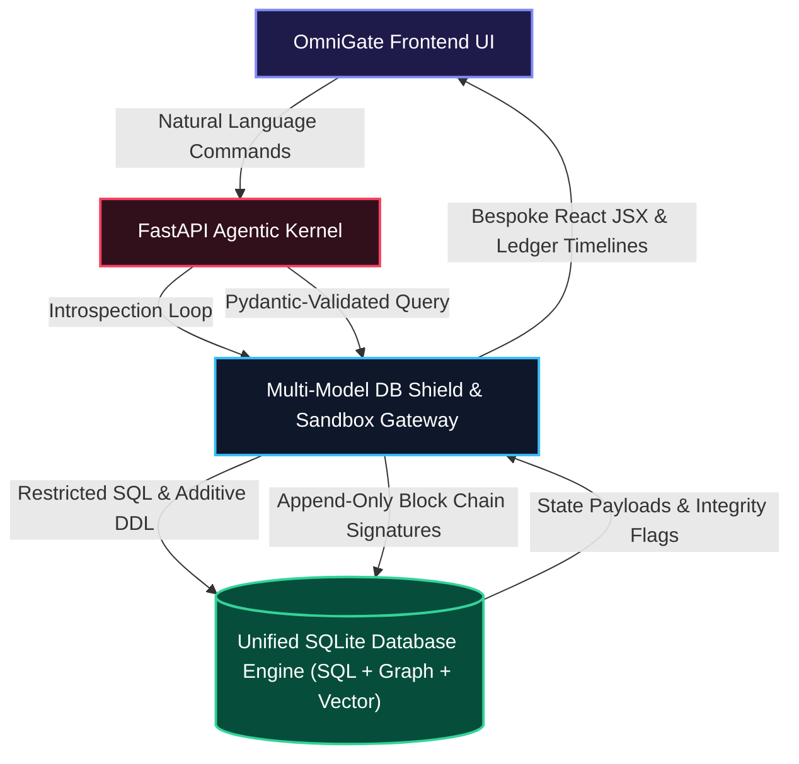

# 🛡️ OmniGate ERP OS: Evolutionary Agentic Kernel

Welcome to the **OmniGate ERP OS**, a revolutionary prototype demonstrating the future of enterprise software: a completely "software-less", UI-less business operating system. In this architecture, autonomous AI agents interact directly with a secure, multi-model database gateway, while generating bespoke, ephemeral user interfaces on-the-fly.

---

## 🌟 Core Philosophy: Zero UI, Full Governance

Traditional ERPs rely on rigid front-end codebases, fixed databases, and complex API wrappers. OmniGate flips this model entirely:
1. **Business Logic is Data**: Workflow instructions are not hardcoded in Python/Java. They are stored natively in the Graph Database as markdown (`skill.md` nodes).
2. **Context is Localized**: Internal rules, CEO directives, and compliance laws are vectorized and strictly mapped to the specific Graph Nodes they govern.
3. **Execution is Sandboxed**: LLMs generate raw SQL and DDL, which passes through a Pydantic-enforced "Shield Gateway" ensuring zero malicious injections or destructive mutations.
4. **Cryptographic Compliance Ledger**: Every action executed by the agents is permanently written to an append-only audit ledger containing SHA-256 hashes of the payload chained together chronologically, guaranteeing complete tamper detection.
5. **UX is Generative**: Based on the exact state of the ledger, a "Vibe Coder" Agent instantly compiles premium, interactive React JSX dashboards in real time.

---

## 🏗️ Architecture & Multi-Model Foundation

The system is built on a hybrid database foundation managed within a unified gateway:

*   **Tabular SQL (Transactional)**: Manages fast, structured operations (`users`, `products`, `orders`, `order_items`).
*   **Graph (Operational Rules)**: Nodes represent specific business capabilities and policies (e.g., *Order Verification Workflow*). Properties contain the exact `skill.md` prompt driving the agent.
*   **Vector (Semantic Context)**: Text chunks (e.g., corporate emails, law excerpts) are vectorized and mapped explicitly to Graph Nodes, providing hyper-localized context to the executing agent.
*   **Cryptographic Ledger**: An `audit_ledger` table recording every state mutation, structured as a cryptographic block chain where each block signs the current payload and links to the previous block's SHA-256 hash.



---

## 🔒 Security & Sandbox Safeguards

### 1. The Shield Gateway Middleware
The backend (`middleware.py`) sits between the LLM and the database, functioning as a multi-model router and security perimeter:
*   **Safe Read Interface**: Permits `SELECT` queries for operational audits.
*   **Safe Mutation Interface**: Validates DDL (`CREATE`, `ALTER`) through strict Pydantic parsers (`DBASchemaMutation`), hard-blocking `DROP` or `TRUNCATE` operations.
*   **Restricted System Actions**: Rejects query executions targeting sensitive metadata or ledger tables (e.g. `audit_ledger`).

### 2. Append-Only Compliance Ledger
*   **SHA-256 Chaining**: Each transaction logs the executing agent name, timestamp, governing graph node, and raw query details. A cryptographic signature (`row_hash`) is computed: `SHA256(id + timestamp + action_type + agent_name + action_details + governing_node_id + prev_hash)`.
*   **Tamper Verification**: Any manual database alteration out-of-band breaks the hash chain, triggering immediate visual alerts in the UI indicating the exact compromised records.

### 3. FinOps Circuit Breaker
To prevent runaway token consumption or infinite LLM execution loops, the system implements a cycle tracker. If an agent loops (e.g., executing the same query 3 times) or exceeds a threshold, the Kernel throws a `SYSTEM_INTERRUPT`, halting execution and rendering a diagnostic UI.

---

## 💻 Running the System

You can run OmniGate in two modes:
*   **Live AI Mode**: If an `OPENAI_API_KEY` is provided in `backend/.env`, the system utilizes GPT-4o for dynamic DDL formulation, compliance auditing, and JSX UI generation.
*   **High-Fidelity Offline Simulator**: If no key is present, the kernel falls back to a robust local simulator. It processes the exact SQLite reads, graph traversals, and vector filtering, but outputs deterministic JSX to ensure the demo remains fully functional offline.

### Prerequisite Setup

1. **Clone & Open the Directory**
   Ensure you are in the root directory `ERPOS/`.

### 1. Start the Backend Kernel
Navigate to the `backend` directory, activate the python virtual environment, and run the FastAPI server:
```bash
cd backend
# Windows:
..\venv\Scripts\activate
# Linux/macOS:
source ../venv/bin/activate

# Initial setup (Seeds the database and sets up the ledger)
python setup_db.py

# Run the API server with live reload
python -m uvicorn main:app --host 127.0.0.1 --port 8000
```

### 2. Start the Frontend Terminal
Navigate to the `frontend` directory, install Node modules, and start the Vite development server:
```bash
cd ../frontend
npm install
npm run dev
```

Open `http://localhost:5173/` in your browser to access the Agentic Kernel Interface.

---

## 🧪 Integration & Safety Verification
To verify the complete safety sandbox and cryptographic ledger pipeline, execute the integration tests:
```bash
cd backend
# With venv active:
python test_api.py
```
This automated suite tests:
*   **Safe operations** execution.
*   **Destructive actions block** (protecting critical tables and blocking DELETE/DROP/TRUNCATE).
*   **Ledger integrity validation** under pristine conditions.
*   **Automated tamper detection** (simulating manual DB changes and checking chain failure flags).
*   **FinOps protection shield intercept** of infinite loop queries.
