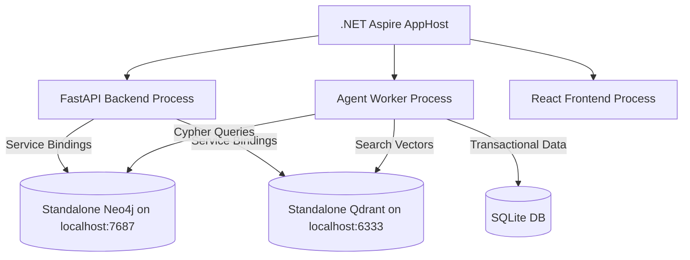

# 🛡️ OmniGate ERP OS

Welcome to the **OmniGate ERP OS**, a production-grade evolutionary operating system that demonstrates the future of enterprise software: a completely "software-less", UI-less business operating system. In this architecture, autonomous AI agents interact directly with a secure, orchestrated multi-model database gateway, while generating bespoke, ephemeral user interfaces on-the-fly.

This system has been upgraded from a simple proof-of-concept into a robust, orchestrated microservices architecture utilizing **.NET Aspire**, standalone **Neo4j**, **Qdrant**, and **RabbitMQ** to support distributed enterprise workloads.

---

## 🌟 Core Philosophy: Zero UI, Full Governance

OmniGate flips the traditional ERP model entirely:
1. **Business Logic is Data**: Workflow instructions are not hardcoded in Python/Java. They are stored natively in the Graph Database (**Neo4j**) as markdown (`skill.md` nodes).
2. **Context is Localized**: Internal rules, CEO directives, and compliance laws are vectorized and strictly mapped in the Vector Database (**Qdrant**) to the specific Graph Nodes they govern.
3. **Asynchronous Execution Pool**: User queries immediately return a task ID and dispatch to **RabbitMQ**. A decoupled pool of **agent workers** polls task queues, processes them asynchronously, and updates the task status.
4. **Execution is Sandboxed**: LLMs generate raw SQL and DDL, which passes through a Pydantic-enforced **Shield Gateway** ensuring zero malicious injections or destructive mutations.
5. **Cryptographic Compliance Ledger**: Every action executed by the agents is permanently written to an append-only audit ledger containing SHA-256 hashes of the payload chained together chronologically, guaranteeing complete tamper detection.
6. **UX is Generative**: Based on the exact state of the ledger, a "Vibe Coder" Agent instantly compiles premium, interactive React JSX dashboards in real time, while the frontend handles progress status updates using polling.

---

## 🏗️ Architecture & Multi-Model Foundation

The system is orchestrated using **.NET Aspire AppHost** to manage service discovery, lifecycle, environment passing, and log aggregation across python backend, workers, and React frontend. It connects to **standalone local servers** for graph and vector databases rather than running them in Docker containers:

*   **Tabular SQL (Transactional)**: Manages fast, structured operations (`users`, `products`, `orders`, `order_items`) inside `backend/erp_database.db`.
*   **Graph Database (Neo4j)**: Standalone Neo4j community server running locally on port `7687`/`7474`. Business workflows and regulations are stored natively as markdown (`skill.md` nodes).
*   **Vector Database (Qdrant)**: Standalone Qdrant server running locally on port `6333`. Corporate policy documents, logs, and emails are vectorized and mapped explicitly to Graph Nodes.
*   **Decoupled Async Queue**: Thread-safe in-memory queues (`local_task_queue`) managed asynchronously by worker threads to process ReAct agent chains sequentially.
*   **Cryptographic Ledger**: An `audit_ledger` table recording every state mutation, structured as a cryptographic blockchain where each block signs the current payload and links to the previous block's SHA-256 hash.



---

## 🔄 Zero-Dependency Hybrid Failover Engine

To ensure the system works out-of-the-box on developer systems that lack running standalone databases or the .NET SDK, we designed a **Hybrid Fallback Engine** in `middleware.py`:
*   **Qdrant**: Falls back to local disk-based persistence (`QdrantClient(path="qdrant_db")`) if port `6333` connection fails.
*   **Neo4j**: Automatically fails over to a local file-based JSON database (`graph_db.json`) if connection to the port `7687` server fails, translating Cypher queries on-the-fly.
*   **RabbitMQ**: Automatically routes tasks to an in-process thread-safe queue (`queue.Queue`) if RabbitMQ connection fails, processing them asynchronously in a daemon worker thread.

---

## 🔒 Security & Sandbox Safeguards

### 1. The Shield Gateway Middleware
The backend (`middleware.py`) sits between the LLM and the database, functioning as a multi-model router and security perimeter:
*   **Safe Read Interface**: Permits `SELECT` queries for operational audits.
*   **Safe Mutation Interface**: Validates DDL (`CREATE`, `ALTER`) through strict Pydantic parsers (`DBASchemaMutation`), hard-blocking `DROP` or `TRUNCATE` operations.
*   **Restricted System Actions**: Rejects query executions targeting sensitive metadata or ledger tables (e.g. `audit_ledger`).

### 2. Append-Only Compliance Ledger
*   **SHA-256 Chaining**: Each transaction logs the executing agent name, timestamp, governing graph node, and raw query details. A cryptographic signature (`row_hash`) is computed: `SHA256(id + timestamp + action_type + agent_name + action_details + governing_node_id + prev_hash)`.
*   **Tamper Verification**: Any manual database alteration out-of-band breaks the hash chain, triggering immediate visual alerts in the UI indicating the exact compromised records.

### 3. FinOps Circuit Breaker
To prevent runaway token consumption or infinite LLM execution loops, the system implements a cycle tracker. If an agent loops (e.g., executing the same query 3 times) or exceeds a threshold, the Kernel throws a `SYSTEM_INTERRUPT`, halting execution and rendering a diagnostic UI.

---

## 💻 Running the System

You can run OmniGate in two modes:
*   **Live AI Mode**: If a `GEMINI_API_KEY` (or custom credentials) is provided in `backend/.env`, the system utilizes Gemini for dynamic DDL formulation, compliance auditing, and JSX UI generation.
*   **High-Fidelity Offline Simulator**: If no key is present, the kernel falls back to a robust local simulator. It processes the exact SQLite reads, graph traversals, and vector filtering, but outputs deterministic JSX to ensure the demo remains fully functional offline.

### Local Failover Startup (No Standalone DBs/Orchestration Required)

We provide a root launcher script [start_local.py](file:///c:/Users/ASUS/Desktop/ERPOS/start_local.py) that concurrently runs the FastAPI server, background worker threads, and Vite frontend.

```bash
# Clone or open the workspace root
cd ERPOS/

# Install python packages in your environment:
cd backend/
..\venv\Scripts\activate
pip install -r requirements.txt

# Initial setup (Seeds the SQLite, JSON graph, and Qdrant local files)
python setup_db.py

# Install frontend dependencies:
cd ../frontend/
npm install

# Start both services concurrently from the root directory:
cd ..
python start_local.py
```

### Production Orchestration Startup (.NET Aspire)

To run the orchestrated microservices stack binding standalone database instances:
1. Ensure your **standalone Neo4j** (port 7687) and **standalone Qdrant** (port 6333) servers are running.
2. Build and run the Aspire AppHost:
   ```bash
   cd aspire/Aspire.AppHost/
   dotnet run
   ```
3. Open the Aspire Dashboard URL displayed in your console to monitor FastAPI backend, Workers, React frontend, consolidated logging, and trace telemetry.

---

## 🧪 Integration & Safety Verification

We provide two test suites to verify system security, cryptographic chains, saga compensation transactions, and role clearances:

### 1. Primary Integration Tests (`test_api.py`)
To verify the complete safety sandbox, cryptographic ledger pipeline, and asynchronous task execution:
```bash
cd backend
# With virtual env active:
python test_api.py
```
This suite validates:
*   **Action & Ledger Security**: Safe operations, blocked DELETEs, blocked ledger updates, cryptographic signature chain integrity, and tamper detection.
*   **Anomalous Transactions**: Worker-based audit of orders against compliance bounds.
*   **Schema Evolution**: Safe database mutations (DDL) enqueued and executed.
*   **Graph/Vector Evolution**: Appending skill nodes to governance graph and mapping vectorized memo rules to Qdrant.
*   **FinOps Circuit Breaker**: Halting runaway query loops.

### 2. Saga & RBAC Clearance Tests (`test_saga_rbac.py`)
To verify distributed transactional integrity and data clearance boundaries:
```bash
cd backend
# With virtual env active:
python test_saga_rbac.py
```
This suite validates:
*   **Dynamic Clearance Control**: Charlie (Customer, clearance 1), Bob (Employee, clearance 2), and Alice (Admin, clearance 3) see only the product records matching their clearance level.
*   **Distributed Saga (Procure-to-Pay)**: Deducts stock -> processes payment -> writes purchase invoice. Failures (e.g. buying limits > $500) trigger automatic compensating rollbacks that restore stock and void transactions.
