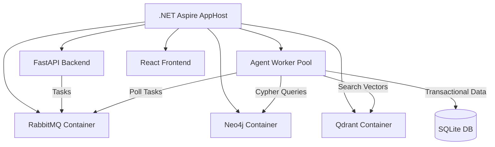

# 🛡️ OmniGate ERP OS

Welcome to the **OmniGate ERP OS**, a production-grade evolutionary operating system that demonstrates the future of enterprise software: a completely "software-less", UI-less business operating system. In this architecture, autonomous AI agents interact directly with a secure, orchestrated multi-model database gateway, while generating bespoke, ephemeral user interfaces on-the-fly.

This system has been upgraded from a simple proof-of-concept into a robust, orchestrated microservices architecture utilizing **.NET Aspire**, standalone **Neo4j**, **Qdrant**, and **RabbitMQ** to support distributed enterprise workloads.

---

## 🌟 Core Philosophy: Zero UI, Full Governance

OmniGate flips the traditional ERP model entirely:
1. **Business Logic is Data**: Workflow instructions are not hardcoded in Python/Java. They are stored natively in the Graph Database (**Neo4j**) as markdown (`skill.md` nodes).
2. **Context is Localized**: Internal rules, CEO directives, and compliance laws are vectorized and strictly mapped in the Vector Database (**Qdrant**) to the specific Graph Nodes they govern.
3. **Asynchronous Execution Pool**: User queries immediately return a task ID and dispatch to **RabbitMQ**. A decoupled pool of **agent workers** polls task queues, processes them asynchronously, and updates the task status.
4. **Execution is Sandboxed**: LLMs generate raw SQL and DDL, which passes through a Pydantic-enforced **Shield Gateway** ensuring zero malicious injections or destructive mutations.
5. **Cryptographic Compliance Ledger**: Every action executed by the agents is permanently written to an append-only audit ledger containing SHA-256 hashes of the payload chained together chronologically, guaranteeing complete tamper detection.
6. **UX is Generative**: Based on the exact state of the ledger, a "Vibe Coder" Agent instantly compiles premium, interactive React JSX dashboards in real time, while the frontend handles progress status updates using polling.

---

## 🏗️ Architecture & Multi-Model Foundation

The system is orchestrated using **.NET Aspire** to bind container resources and manage telemetry/service discovery.

*   **Tabular SQL (Transactional)**: Manages fast, structured operations (`users`, `products`, `orders`, `order_items`).
*   **Graph Database (Neo4j)**: Nodes represent specific business capabilities and policies (e.g., *Order Verification Workflow*). Properties contain the exact `skill.md` prompt driving the agent.
*   **Vector Database (Qdrant)**: Text chunks (e.g., corporate emails, law excerpts) are vectorized and mapped explicitly to Graph Nodes, providing hyper-localized context to the executing agent.
*   **Message Broker (RabbitMQ)**: Manages asynchronous task queues (`agent_tasks`) to coordinate worker pools.
*   **Cryptographic Ledger**: An `audit_ledger` table recording every state mutation, structured as a cryptographic blockchain where each block signs the current payload and links to the previous block's SHA-256 hash.



---

## 🔄 Zero-Dependency Hybrid Failover Engine

To ensure the system works out-of-the-box on developer systems that lack Docker or the .NET SDK, we designed a **Hybrid Fallback Engine** in `middleware.py`:
*   **Qdrant**: Seamlessly falls back to local disk-based persistence (`QdrantClient(path="qdrant_db")`), functioning locally without any server.
*   **Neo4j**: Automatically fails over to a local file-based JSON database (`graph_db.json`) if connection to the server fails, translating Cypher queries on-the-fly.
*   **RabbitMQ**: Automatically routes tasks to an in-process thread-safe queue (`queue.Queue`) if RabbitMQ is not running, processing them asynchronously in a daemon worker thread.

---

## 🔒 Security & Sandbox Safeguards

### 1. The Shield Gateway Middleware
The backend (`middleware.py`) sits between the LLM and the database, functioning as a multi-model router and security perimeter:
*   **Safe Read Interface**: Permits `SELECT` queries for operational audits.
*   **Safe Mutation Interface**: Validates DDL (`CREATE`, `ALTER`) through strict Pydantic parsers (`DBASchemaMutation`), hard-blocking `DROP` or `TRUNCATE` operations.
*   **Restricted System Actions**: Rejects query executions targeting sensitive metadata or ledger tables (e.g. `audit_ledger`).

### 2. Append-Only Compliance Ledger
*   **SHA-256 Chaining**: Each transaction logs the executing agent name, timestamp, governing graph node, and raw query details. A cryptographic signature (`row_hash`) is computed: `SHA256(id + timestamp + action_type + agent_name + action_details + governing_node_id + prev_hash)`.
*   **Tamper Verification**: Any manual database alteration out-of-band breaks the hash chain, triggering immediate visual alerts in the UI indicating the exact compromised records.

### 3. FinOps Circuit Breaker
To prevent runaway token consumption or infinite LLM execution loops, the system implements a cycle tracker. If an agent loops (e.g., executing the same query 3 times) or exceeds a threshold, the Kernel throws a `SYSTEM_INTERRUPT`, halting execution and rendering a diagnostic UI.

---

## 💻 Running the System

You can run OmniGate in two modes:
*   **Live AI Mode**: If a `GEMINI_API_KEY` (or custom credentials) is provided in `backend/.env`, the system utilizes Gemini for dynamic DDL formulation, compliance auditing, and JSX UI generation.
*   **High-Fidelity Offline Simulator**: If no key is present, the kernel falls back to a robust local simulator. It processes the exact SQLite reads, graph traversals, and vector filtering, but outputs deterministic JSX to ensure the demo remains fully functional offline.

### Local Failover Startup (No Docker Required)

We provide a root launcher script [start_local.py](file:///c:/Users/ASUS/Desktop/ERPOS/start_local.py) that concurrently runs the FastAPI server, background worker threads, and Vite frontend.

```bash
# Clone or open the workspace root
cd ERPOS/

# Install python packages in your environment:
cd backend/
..\venv\Scripts\activate
pip install -r requirements.txt

# Initial setup (Seeds the SQLite, JSON graph, and Qdrant local files)
python setup_db.py

# Install frontend dependencies:
cd ../frontend/
npm install

# Start both services concurrently from the root directory:
cd ..
python start_local.py
```

### Production Orchestration Startup (.NET Aspire)

To run the containerized microservices stack:
1. Ensure the **.NET 9 SDK** and **Docker Desktop** are running.
2. Build and run the Aspire AppHost:
   ```bash
   cd aspire/Aspire.AppHost/
   dotnet run
   ```
3. Open the Aspire Dashboard URL displayed in your console to monitor RabbitMQ, Neo4j, Qdrant, logs, and trace telemetry.

---

## 🧪 Integration & Safety Verification

To verify the complete safety sandbox, cryptographic ledger pipeline, and asynchronous task execution, execute the integration tests:
```bash
cd backend
# With virtual env active:
python test_api.py
```
This automated suite runs:
*   **Safe operations** execution.
*   **Destructive actions block** (protecting critical tables and blocking DELETE/DROP/TRUNCATE).
*   **Ledger integrity validation** under pristine conditions.
*   **Automated tamper detection** (simulating manual DB changes and checking chain failure flags).
*   **FinOps protection shield intercept** of infinite loop queries.
*   **Asynchronous task scheduling** and polling execution loops.
