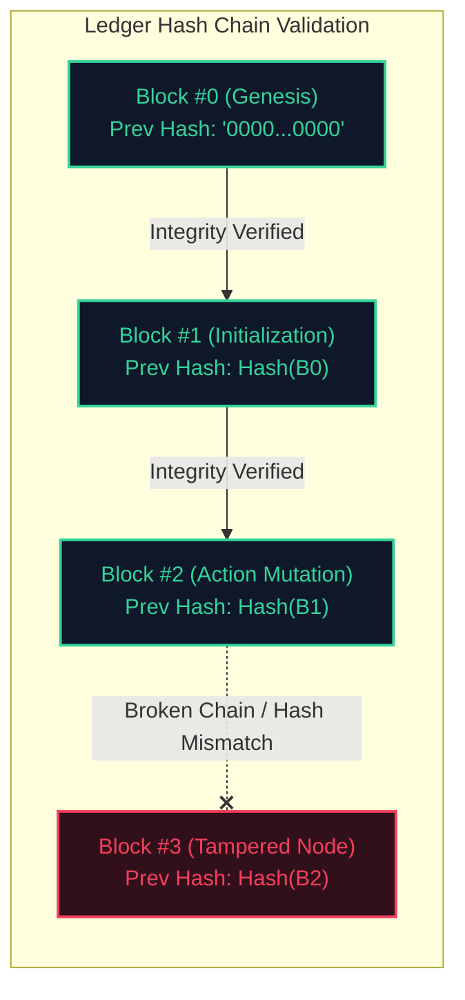

# 🧠 OmniGate ERP OS: Agentic Kernel Backend

This is the core execution kernel of the **OmniGate ERP OS**, powered by a FastAPI server, a multi-model SQLite database, and an autonomous ReAct agent loop.

---

## 🚀 Key Modules & Architecture

### 1. Multi-Model Shield Gateway (`middleware.py`)
Acts as a sandbox proxy between executing AI agents and the system database, enforcing strict security protocols:
*   **Generalized Action Mutation Parser**: Captures all agent database requests through Pydantic (`GeneralizedActionMutation`). It restricts query verbs to safe mutations (`INSERT` and `UPDATE`), preventing execution of destructive actions (`DELETE`, `DROP`, `TRUNCATE`, `RENAME TO`).
*   **Database Schema Evolution Gate**: Allows DBA agents to perform additive schema mutations (`CREATE TABLE`, `ALTER TABLE`) to adapt the system dynamically while blocking table drops.
*   **System Integrity Guard**: Blocks queries targeting system metadata tables or the compliance ledger (`audit_ledger`).
*   **Cryptographic Ledger Builder**: Computes SHA-256 signatures for every state change. Each transaction block is signed using:
    `row_hash = SHA256(id + timestamp + action_type + agent_name + action_details + governing_node_id + prev_hash)`
*   **Integrity Auditing Engine**: Iterates over the entire `audit_ledger` history, verifying that the hashes match and that no out-of-band updates have broken the blockchain structure. Returns flagged indices upon detecting anomalies.



### 2. Autonomous ReAct Execution Engine (`main.py`)
Orchestrates agent reasoning cycles and provides APIs for the frontend:
*   **ReAct Loop Wrapper**: Implements Thought-Action-Observation reasoning. Resolves user instructions against the database, policy vectors, and workflow rules.
*   **Multi-Model Execution Tools**:
    1. `execute_sql` (Read-only transactional table queries)
    2. `execute_ddl` (Additive schema modification)
    3. `traverse_graph` (Retrieve node edges and workflows)
    4. `vector_search` (Global policy search)
    5. `node_vector_search` (Node-specific contextual search)
    6. `evolve_graph_node` (Evolve/insert Graph nodes/edges)
    7. `vectorize_document` (Vectorize and map documents to nodes)
*   **Endpoints**:
    *   `POST /api/query`: Submits natural language prompts to the agent loop.
    *   `POST /api/action/execute`: Executes parameter-mapped SQL updates governed by graph nodes.
    *   `GET /api/ledger`: Performs cryptographic verification and returns the audit trail.
    *   `GET /api/graph`: Returns active governance nodes (workflows/regulations) and edge definitions.
    *   `GET /api/schema`: Dynamically introspects and returns SQL table structures.

### 3. Database Seeding & Setup (`setup_db.py`)
Initializes the SQLite engine (`erp_database.db`) with:
*   Standard business tables (`users`, `products`, `orders`, `order_items`).
*   A governance workflow graph mapping nodes (e.g. Node 1: *High Value Transaction Policy*, Node 2: *Order Verification Workflow*) to specific markdown-formatted `skill.md` regulatory guides.
*   Vector partitions containing semantic compliance context.
*   An initialization block and a genesis block inside the `audit_ledger` to kick off the cryptographic hash chain.

---

## ⚙️ Configuration & Environment Setup

1. **Virtual Environment Setup**:
   Create and activate a python environment:
   ```bash
   python -m venv venv
   # Windows:
   venv\Scripts\activate
   # Linux/macOS:
   source venv/bin/activate
   ```

2. **Dependencies**:
   Install backend dependencies:
   ```bash
   pip install -r requirements.txt
   ```

3. **Environment Keys**:
   Create a `.env` file from the template and optionally configure your key:
   ```bash
   cp .env.template .env
   ```
   *Note: If no API key is specified, the system starts in a simulated mode, allowing full functionality of graph and ledger updates without calling external LLMs.*

---

## 🧪 Safety & Integrity Testing

Verify the security proxy, cryptographic audit ledger, and circuit breaker protections by running:
```bash
python test_api.py
```

The script performs the following validation steps:
1. **Safe Action Verification**: Executes a valid database update and confirms successful storage.
2. **Safety Sandboxing**: Proposes a destructive `DELETE` statement and confirms it is blocked.
3. **Internal Protection**: Proposes updating the `audit_ledger` directly and confirms it is blocked.
4. **Ledger Audit Checks**: Confirms a clean database logs as valid and verified.
5. **Tamper Intercept**: Updates a ledger row directly in SQLite (simulating an attacker) and confirms the `/api/ledger` endpoint flags the record and fails validation.
6. **Execution safety**: Validates that agent query loops are halted by the circuit breaker.
