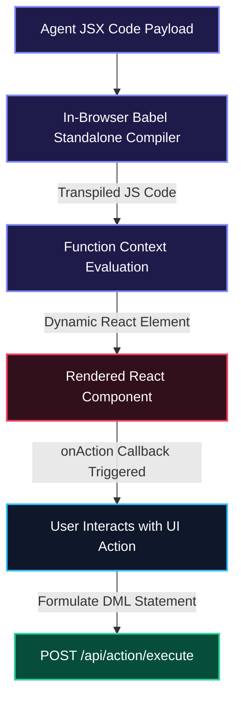

# 🖥️ OmniGate ERP OS: Generative Frontend Terminal

This is the React + TypeScript + Vite frontend client for the **OmniGate ERP OS**. It serves as a glassmorphic terminal interface where users submit commands to the Agentic Kernel, view agent traces, and interact with dynamically compiled dashboards.

---

## 🎨 Phase 2 UI Upgrades

The terminal is designed with sleek glassmorphic aesthetics, neon indicators, and interactive micro-animations to support Phase 2 functionalities:

### 1. Generative UI Sandbox (`DynamicRenderer`)
*   **Babel Standalone Compilation**: Leverages browser-side `@babel/standalone` to compile agent-formulated JSX code on-the-fly.
*   **Action Intercept System**: Mounts the compiled component with an `onAction` callback. When the user interacts with generated buttons (like *Approve Order* or *Reorder Stock*), the application compiles parameter-mapped SQL updates and submits them to the backend sandbox API at `/api/action/execute`.

### 2. Interactive Schema Explorer & Governance Graph
*   **Visual SVG Topology Map**: A custom SVG canvas rendering the business rules and policy nodes in a live node-link diagram.
    *   **Workflow & Regulation Nodes**: Hover and click interactions to inspect specific nodes.
    *   **Governance Details**: Displays description, active parameters, and bound markdown directives (`skill.md`) immediately on selection.
*   **Active Table Schemas**: Displays SQLite schemas next to the visual topology for side-by-side database structure and agent rule monitoring.

### 3. Append-Only Cryptographic Ledger Timeline
*   **Real-time Chain Verification**: Displays a visual timeline of transaction blocks recorded in the database ledger.
*   **Cryptographic Status Banners**:
    *   🟢 **Green Banner**: Success banner when all blocks have matching, chained SHA-256 signatures.
    *   🔴 **Red Alert Banner**: Glow-shake banner flagging database tampering out-of-band, listing the exact corrupted block indices.
*   **Verification Payload Details**: Clickable panels showing transaction details, timestamps, executing agent, and raw cryptographic signatures (`prev_hash` & `row_hash`).

### 4. Interactive Suggestion Chips
Includes shortcuts to trigger compliance audits, evolutionary schema creations, infinite loop tests (verifying FinOps breakers), and direct cryptographic ledger verifications.

### 5. Evaluation Center & Knowledge Optimizer
A dedicated workspace tab providing full transparency into model test suites and system optimization:
*   **Performance Metrics Grid**: Displays live stats including overall scenario Pass Rates, Total Runs executed, count of active testing Scenarios, and asynchronous Worker queue health.
*   **Asynchronous Scenario Panel**: Lists the 10 core capability tests with color-coded status badges (`pending`, `running`, `completed`, `failed`).
*   **Step-by-Step Scenario Detail Inspector**: Highlights the expected vs. actual outputs, the full ReAct agent execution trace steps, and the generated ephemeral React JSX UI.
*   **LLM vs Heuristic Comparison**: Visualizes the LLM-as-a-judge score (1-5 stars) and detailed CoT feedback side-by-side with deterministic heuristic keyword passes, alerting auditors on verdict discrepancies.
*   **Human Auditing Form**: Enables manual reviews with star ratings (1-5 stars), pass overrides, and feedback notes, committing results directly to the database.
*   **Interactive Knowledge Optimizer**: Provides code editing textareas for Neo4j workflow skill nodes (`skill_markdown`) and a CRUD data table for Qdrant vector partitions (upserting and deleting localized policies directly).



---

## 🛠️ Technology Stack

*   **Framework**: React 19 + Vite 8 (TypeScript)
*   **Styling**: Vanilla CSS (Premium dark mode assets) + TailwindCSS (Play CDN structure)
*   **Icons**: `lucide-react`
*   **Compiler**: In-browser `@babel/standalone`

---

## 🚀 Running the Terminal

The terminal can be launched in two configurations:

### 1. Standalone Developer Mode
Runs the Vite frontend directly against a local API endpoint on port 8000:
1. **Install Dependencies**:
   ```bash
   npm install
   ```
2. **Start Dev Server**:
   ```bash
   npm run dev
   ```
3. **Access Application**:
   Open [http://localhost:5173](http://localhost:5173) in your browser.

### 2. Orchestrated Microservices Mode (.NET Aspire)
When running inside the .NET Aspire stack, the AppHost automatically orchestrates the frontend node process:
1. **Startup**: Managed via the root `dotnet run` command under `aspire/Aspire.AppHost/`.
2. **Port Binding**: Port `5173` is assigned dynamically, routing HTTP calls directly to the FastAPI service.
3. **Telemetry Logs**: Standard Vite dev-server outputs are streamed directly to the OpenTelemetry trace panel in the Aspire Dashboard on port `18888`.

---

## ⚙️ Compilation & Parameter Validation Mechanics

*   **Babel Transforming**: Before compilation via `@babel/standalone`, the UI parser strips out ES6 `import` and `export` statements dynamically, converting modular exports to inline component registrations to avoid runtime evaluations errors in browser sandbox.
*   **Dynamic Parameter Prompter**: When user clicks on a generated UI action (e.g. *Approve Credit*, *Reorder Stock*), the client-side execution gateway validates necessary schema parameters. If parameters are missing, it falls back to prompting the user or semantically extracting placeholders from current agent traces to prevent invalid database transactions.

